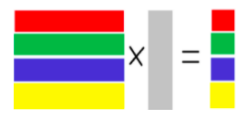
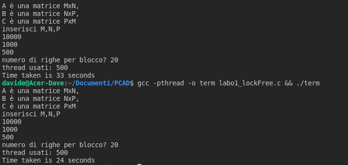

<i>data progetto: 15 aprile 2022</i>

# PCAD 2021-22, Foglio 1: Architetture e parallelismo

Un modo molto semplice di parallelizzare calcoli su matrici è basato sulla decomposizioni in
blocchi delle matrici sulle quali si opera. 
Ad es. consideriamo una matrice A (M x N) e un vettore V (N x 1). 
Nella decomposizione per righe la matrice A si divide in T blocchi di R righe (M=TxR) 
Ogni blocco RxN si può quindi moltiplicare per V ottenendo un nuovo vettore R x 1 
Concatenando i T vettori risultanti (vedi figura sotto) otteniamo il vettore A x V (M x 1). 

 
Nel caso di prodotto di matrice per matrice l’applicazione della decomposizione produce R
righe della matrice risultante. 
Lo scopo dell’esercizio è quello di scrivere un programma C con la libreria pthread per
applicare la decomposizione per righe delegando la moltiplicazione blocco per blocco a
diversi thread. 
Più precisamente il programma deve effettuare la moltiplicazione C * (A * B) tra matrici di
float dove:
<ul>
<li>A è una matrice MxN,
<li>B è una matrice NxP,
<li>C è una matrice PxM
</ul>

Per sfruttare il multithreading utilizzare la decomposizione per righe per calcolare sia R=A*B
che C*R (il risultato è una matrice PxP). 
 
Utilizzate gli stessi thread nelle due fasi di calcolo applicando una barriera per sincronizzare
le due fasi di calcolo: i thread devono attendere in barriera il completamento della prima
parte di calcolo e dopo la seconda decomposizione completare il calcolo. 
Fate in modo che sia possibile configurare il numero di blocchi delle due decomposizioni in
maniera da misurare l’eventuale aumento di performance al variare del numero di thread. 
Per analizzare i tempi di esecuzione potete usare le funzioni della libreria “time.h”.

### Risultato
 
